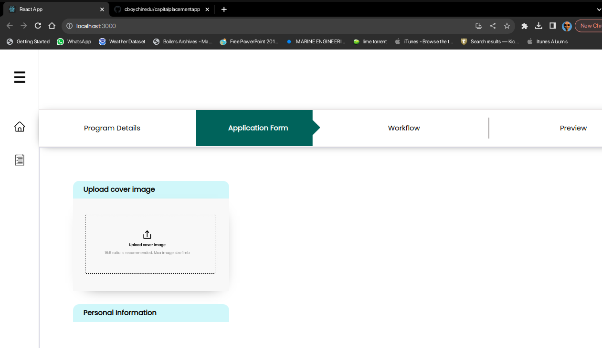
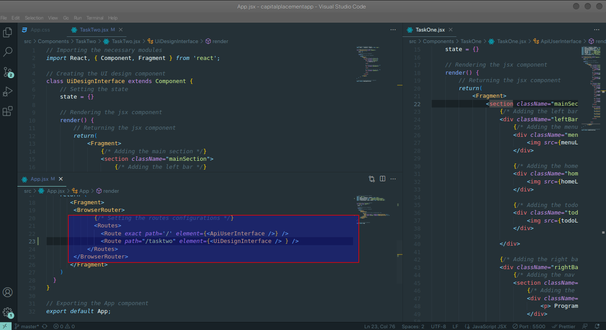

## Capitalplacementapp QUIZ



<p> 
This README.md file provides step-by-step instructions on how to clone a ReactJS project from GitHub and set it up, including installing the necessary modules and libraries to create a basic React web application with two routes. <br>

This assumes you have Git, Nodejs, and npm (Node Package Manager) already installed on your system.

</p>

<h2> Prerequisites </h2>
<p> Before diving into the routing mechanism, ensure that you have the following prerequisites installed: 
<ul>
<li> LinuxGit | WindowsGit </li> 
<li> Nodejs </li> 
<li> npm (Node Package Manager) (included with Nodejs) </li>
<li> React </li>
<li> react-router-dom </li>
</ul>
</p>

<h2> Steps to Clone and Set Up the Project </h2>
<p>
Follow these steps to clone the project and set up the basic ReactJS web application with two routes:

<ul>
<li> <b> Clone the GitHub Repository: </b><br> 
    Open your terminal or command prompt and navigate to the directory where you want to clone the project. Then, run the following command to clone the repository from using <b>SSH</b> GitHub: 
      
</li> 
</ul>
</p>

```bash
    $ git clone git@github.com:cboychinedu/capitalplacementapp.git
```

<ul>
<li> <b> Navigate to the Project Directory, And Install: </b> <br> 
    After cloning the repository, navigate to the project directory using the 'cd' (change directory) command, and install by running the following command in your command line interface. 
</li>
</ul>

```bash
    $ cd capitalplacementapp
    $ npm install .
    $ npm start
```

<h2> Routing Configuration </h2> 


<p> 
In the provided code snippet, the routing mechanism is configured using the <b>'react-router-dom'</b> library. Here's an explanation of the Key components and steps involved in this routing mechanism:

<ol>
<li> 
Task One (API & UI):
<ul>
<li> Route: <a href="http://localhost:3000"> localhost:3000 </a> </li>
</ul>
</li>
<li>
Task Two (UI Design)
<ul>
<li> Route: <a href="http://localhost:3000/tasktwo"> localhost:3000/tasktwo </a> </li> 
</ul>
</li>
</ol>
</p>
